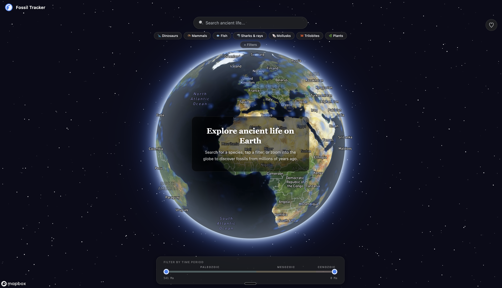

# Fossil Finder

Fossil Finder is an interactive 3D globe for exploring fossil records from across Earth's history. There are millions of fossil records sitting in scientific databases, but they're buried behind academic interfaces that weren't really built for curious people. I've always been fascinated by dinosaurs and ancient life, so I wanted a way to spin a globe, pick a time period and see what was living there 200 million years ago.



**Try it live at [fossil-finder.tyrion.uk](https://fossil-finder.tyrion.uk)**

All the fossil data comes live from the [Paleobiology Database](https://paleobiodb.org), and species summaries come from Wikipedia.

## Features

- A 3D Mapbox globe with satellite imagery and a starry space atmosphere around it.
- Fossil markers cluster together when you're zoomed out and split into individual finds as you zoom in.
- Search for any species or group with autocomplete suggestions.
- One-tap filters for dinosaurs, mammals, fish, sharks and rays, molluscs, trilobites and plants.
- A filter panel for narrowing by organism group or geological period, from the Cambrian to the Quaternary.
- A timeline slider that covers 541 million years up to the present day, colour-coded by era.
- A results panel listing the finds that match your search.
- A detail panel for each fossil with its taxonomy (with plain English descriptions of each rank), diet, life habit, environment and a satellite map of where it was found.
- A species page with a Wikipedia summary and a reconstruction image or photo.
- Favourites, saved in your browser so they're still there next time.

## Built with

- JavaScript and React 19
- Vite
- Mapbox GL through react-map-gl
- The Paleobiology Database API and the Wikipedia REST API
- Vitest and React Testing Library
- ESLint
- Docker, serving the static build with `serve`

## Running it locally

You'll need Node.js and a free [Mapbox access token](https://account.mapbox.com/).

Create a `.env` file in the project root with one variable:

- `VITE_MAPBOX_TOKEN`

Then install and start the dev server:

```bash
npm install
npm run dev
```

Vite will print the local address, usually http://localhost:5173.

Other scripts:

```bash
npm run test:run   # run the tests once
npm test           # run the tests in watch mode
npm run lint       # ESLint
npm run build      # production build into dist/
npm run preview    # preview the production build
```

There's also a Dockerfile, which builds the app and serves it on port 3000. Vite bakes the Mapbox token in at build time, so it has to be available when the image is built.
